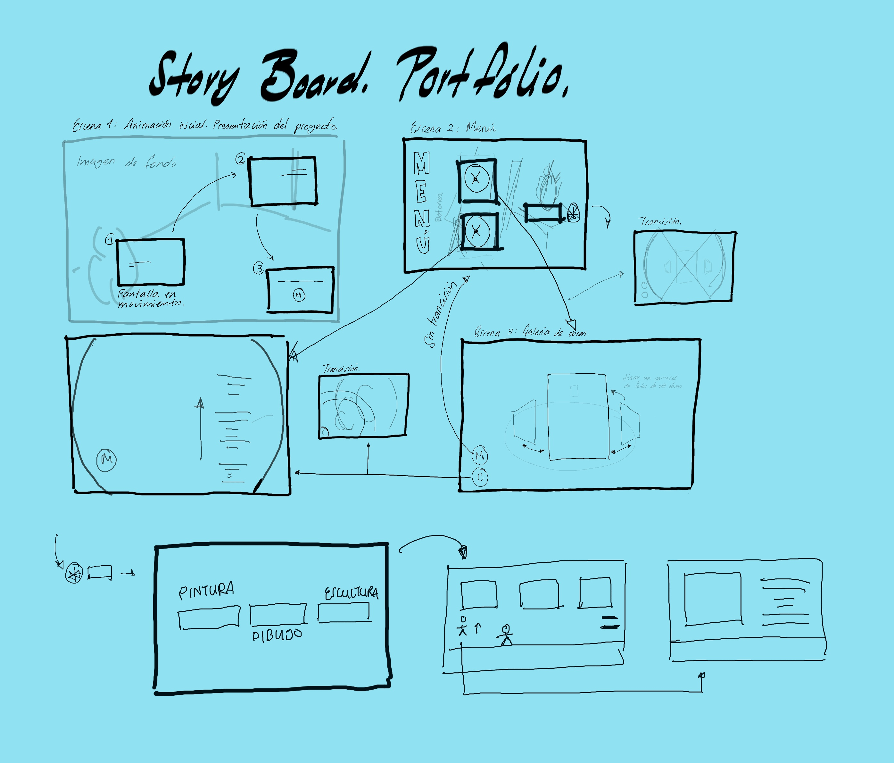

## Portfolio de artista

Proyecto de Creación Multimedia Interactiva de la  Facultad de Bellas Artes de la Univesidad de Granada

# 1 Datos 

**Titulo** : Portfolio
**Web:**   (url github.io)

**Autor:**  Renée Cendejas Frank

 [Profile Card](cmi-card.html)  [Alternate Profile Card](cmi-card2.html)

**Resumen** : Este proyecto os mostrará un poco de mis proyerctos como artista emergente y estudiante de la facultad de bellas artes. Incluye en algunos de sus apartados una explicación sobre mi proceso y datos de algunas de mis obras más significativas.

**Estilo/género:**  Portfolio

**Logotipo** : (insertar imagen y breve justificación, si  tiene) 

(insertar imágenes a resolucion de 100px alto)

**Resolución:** 800x600px responsivo/o tamaño fijo (indicar la que has aplicado, y si es reescalable)

**Probado en:**   
**Tamaño proyecto:** 70MB 

**Licencia** Este proyecto tiene una Licencia CC Reconocimiento Compartir igual (CC BY-SA)

**Fecha** : 14/05/2020

**Medios** (donde se tiene presencia relacionada):

- Github:
- Tick Tok
- Instagram 

.jpg)

# 2. Memoria del proyecto 

### 2.1 Storyboard: 
Inicialmente hay una breve presentación que nos llevará a un menú principal, donde se encontrará el botón de la galería de mis proyectos, esta está realizada a modo de carrusel, por el cual los espectadores podrán ver un poco de mi obra ded manera más entretenida. Posteriormente encontraremos el apartado de "mis obras", la cual nos llevará a diferentes secciones: pintura, dibujo y escultura. Cuando entramos a alguno de estos apartados enontraremos tres obras claves y un pequeño personaje, este tendremos que moverlo de lado a lado y saltar, en caso de que toque a alguna de estas obras nos llevará a un subapartado en la que se nos presentará una explicación de esta, por lo que sabremos un poquito más de la pieza. Esta dinámica será la misma en los tres ámbitos artísticos.

### 2.2. Esquema de navegación 

(imagen con las distintas pantallas de navegación, usa draw.io o cualquier programa de dibujo)

# 3. Metodología

Metodología de desarrollo de productos multimedia basado en una metodología de UX (User Experience)

## Etapa 1: Ideación de proyecto

**Investigación de campo** (propuestas inspiradoras para el proyecto)

- Portfolio [Leonardi Web page](http://www.rleonardi.com/interactive-resume/) para idear cómo organizar el material
- 

**Motivación de la propuesta** 

Considero que puede ser un proyecto interesante ya que ahora en un mundo lleno de redes sociales y tecnologías, sigue siendo complicada la visibilidad de los artistas. Esto se debe a que al haber tanto contenido sin límite la genete no se detiene a contemplar proyectos, por eso hacer un portfolio a modo de juego o de una manera más interactiva, puede capturar un poco más la atención de la gente.

**Publico / audiencia**

- Orientado a publico abierto, ya sea por visualizar contenido, como presentarlo como proyecto, o incluso para gente que se plantee hacerm4e algun pedido y conozca un poco más de mi y mis piezas. 

## Etapa 2: Desarrollo / actividades realizadas

- Juego. 
- texto de guía sobre las obras
- Galería
- Menús y elementos de navegación (botones)

## Etapa 3: Problemas identificados

Considera que aun no funciona muy bien el tema de interactividad, creo que debería ser aun más dinámico y el personaje debería estar más acorte a la estética del portfolio.

# 4. Conclusiones 

(explica brevemente tu valoración, problemas que has detectado y que te gustaría hacer o mejorar en el futuro )

# 5 Referencias 

**Artículos y blogs** 

- Crofts, S., Fox, M., Retsema, A. and Williams, B. (2005) *Podcasting: A new technology in search of viable business models*First Monday, 10(9). https://doi.org/10.5210/fm.v10i9.1273. Recuperado el 8 de abril de 2020 de: https://journals.uic.edu/ojs/index.php/fm/article/view/1273/1193

**Recursos y materiales audiovisuales:**

* Musica:  
* Imágenes:  
* Tipografía: 

**Herramientas utilizadas**

- Godot Engine 4.x
- 

(imagen de la licencia, copiar y pegar aquí la correcta)
https://creativecommons.org/licenses/?lang=es

* logos en https://creativecommons.org/mission/downloads/
  
  </small>

Mayo 202X
